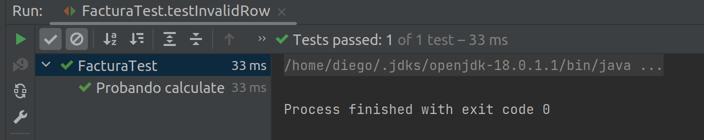
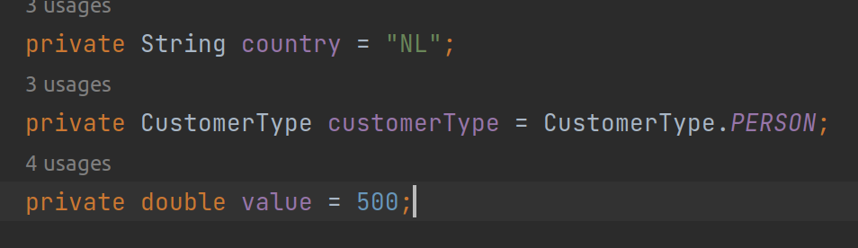
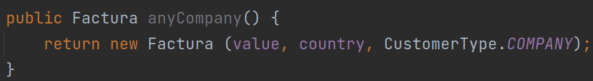

# Examen Parcial de Desarrollo de software
## Respuesta la pregunta 2

### 1. El código de prueba para el método calculate() .
He desarrollado el siguiente código, el cual primero crea una instancia de la factura con un valor fijo, para luego
usando el método assertEquals verificar que el valor entregado por el método calculate() sea igual al valor que
estamos esperando. El test fallaría si no coinciden ambos valores.

donde vemos que efectivamente el test ha sido pasado con éxito.

### 2. ¿Qué significa var factura = new FacturaBuilder().build();?
Significa que se primero se genera una instancia de FacturaBuilder, la cual tendrá los atributos por defectos como se 
puede ver en el constructor sin argumentos, es decir, esta instancia tendría los siguientes atributos por defecto

Luego de eso, con el método build, esta instancia de FacturaBuilder creará una instancia del tipo Factura con los
atributos que hemos visto arriba (country = 'NL', customerType = customerTyper.PERSON y value = 500).

### 3. ¿Qué hace este código?

Este primer código muestra lo que sería un método de FacturaBuilder, recordemos que FacturaBuilder tiene atributos que
son usados para crear las Facturas y que pueden ser cambiados en cualquier momento, entonces lo que hace este codigo es
devolvernos una instancia de Factura, donde para crear esta instancia usara los atributos value y country de la 
instancia FacturaBuilder pero no el atributo customerType, sino que directamente generará esta factura como del tipo
COMPANY.

