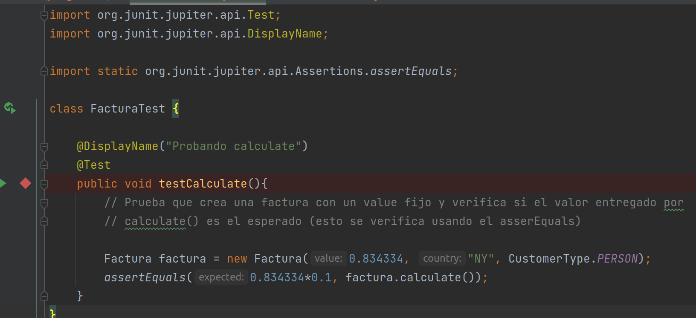

# Examen Parcial de Desarrollo de software
## Respuesta la pregunta 2

### 1. El código de prueba para el método calculate() .
He desarrollado el siguiente código, el cual primero crea una instancia de la factura con un valor fijo, para luego
usando el método assertEquals verificar que el valor entregado por el método calculate() sea igual al valor que
estamos esperando. El test fallaría si no coinciden ambos valores.

donde vemos que efectivamente el test ha sido pasado con éxito.

### 2. ¿Qué significa var factura = new FacturaBuilder().build();?
Significa que primero se genera una instancia de FacturaBuilder, la cual tendrá los atributos por defectos dado que el
constructor sin argumentos no ha sido sobreescrito, por lo que solo generará una con los atributos por defecto, es decir,
esta instancia tendría los siguientes atributos por defecto.

Luego de eso, con el método build, esta instancia de FacturaBuilder creará una instancia del tipo Factura con los
atributos que hemos visto arriba (country = 'NL', customerType = customerTyper.PERSON y value = 500), finalmente esto
será guardado dentro de la variable factura.

### 3. ¿Qué hace este código?

Este primer código muestra lo que sería un método de FacturaBuilder, recordemos que FacturaBuilder tiene atributos que
son usados para crear las Facturas y que pueden ser cambiados en cualquier momento, entonces lo que hace este codigo es
devolvernos una instancia de Factura, donde para crear esta instancia usando los atributos value y country de la 
instancia FacturaBuilder pero no el atributo customerType, sino que directamente generará esta factura como del tipo
COMPANY independientemente del valor que tenga el FacturaBuilder en customerType.

Este otro codigo es similar, solo que usará los atributos modificables de la instancia
Factura Builder (value, customerType) e instanciará una factura con estos atributos, además de 
directamente setear su variable country como "US" independientemente del valor que tenga seteado en customerType la 
instancia del FacturaBuilder.

### 4. Usa las variables facturaValue y tax en la aseveración para hacer la prueba más clara a través de variables explicativas

podemos hacer algo tal como sigue a continuación para que el codigo sea mas claro

donde detallamos cada variable a usar, es decir el valor, tax y country que tendra la boleta, luego de esto solo 
procedemos a crear el builder con el country y el value, haciendo tambien que sea del tipo compañia, para despues
instancia una factura con estos datos, para finalmente calcular el valor esperado y verificamos que este sea identico 
al valor devuelto por calculate() donde el test falla si son diferentes, caso contrario el test es pasado con exito.